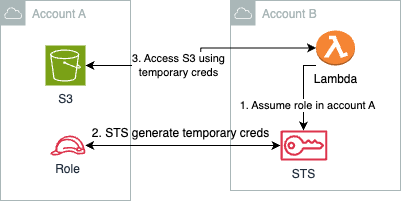

# lambda-cross-account-s3-access
This project demonstrates how a lambda function in account A accesses an S3 bucket in account B by assuming a role in account B. 



## Prerequisites
- **Two AWS Accounts**: 
  - **Account A** (S3 Bucket Owner)
  - **Account B** (Lambda Function Owner)
  
- **AWS CLI** and **IAM permissions** to set up roles and policies in both accounts.

## Architecture Overview

1. **Account A**: Contains an S3 bucket and a role that grants access to this bucket. The role also has a trust relationship allowing it to be assumed by the Lambda role in Account B.
2. **Account B**: Contains a Lambda function and a role that can assume the role in Account A using AWS STS.

---

## Steps to Configure the Environment

### Step 1: Setup Role in Account A for S3 Access

1. **Login to Account A**.
2. **Create an S3 Bucket**:
   - Navigate to the **S3 Console**.
   - Create a new bucket or use an existing one. Note the bucket name.

3. **Create an IAM Role in Account A**:
   - Go to the **IAM Console** and select **Roles** > **Create role**.
   - Choose **Another AWS Account** as the trusted entity.
   - Enter **Account B’s** account ID (You can find this in Account B’s IAM Dashboard).
   - Add **Account B’s** lambda role ARN 
   - Attach a policy that grants access to the S3 bucket:

   ```json
   {
     "Version": "2012-10-17",
     "Statement": [
       {
         "Effect": "Allow",
         "Action": "s3:*",
         "Resource": [
           "arn:aws:s3:::<your-bucket-name>",
           "arn:aws:s3:::<your-bucket-name>/*"
         ]
       }
     ]
   }
